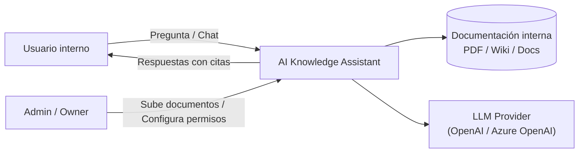
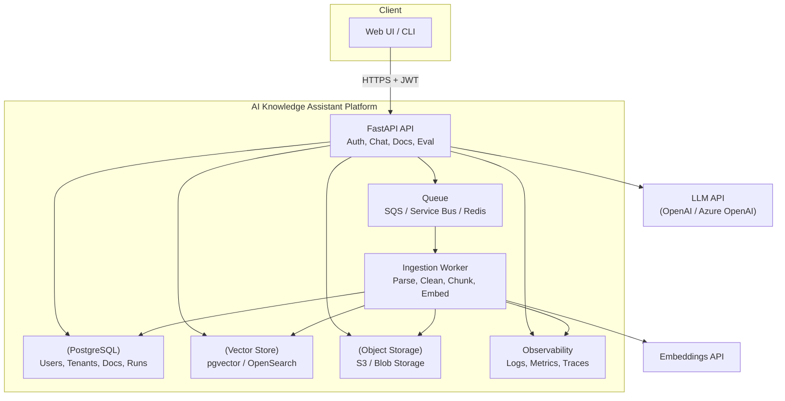
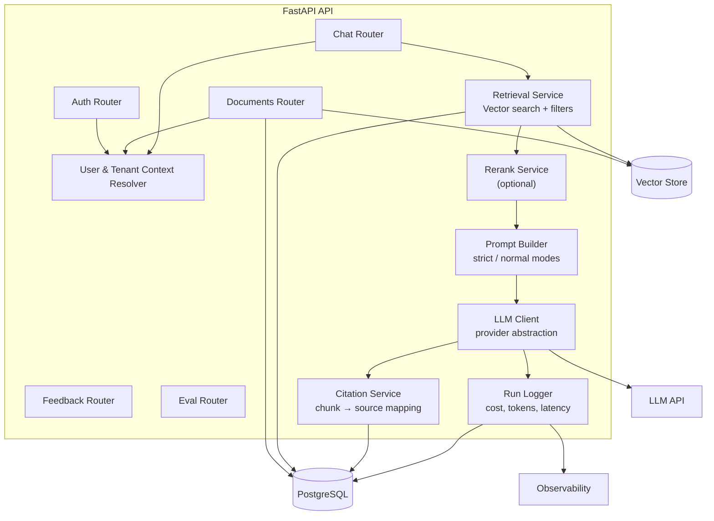

# Architecture

This document describes the architecture of the **AI Knowledge Assistant for Enterprises**.
The system is designed as a multi-tenant RAG platform with strict retrieval guarantees,
asynchronous ingestion, and full observability.

---

## C4 – Level 1: System Context

**Explanation**

- Users interact with the system through natural language.
- Admins manage documents and access control.
- The system never answers without consulting internal documentation.
- LLMs are used only for reasoning and language generation.

---

## C4 – Level 2: Container Diagram

**Explanation**

- The API handles authentication, chat orchestration, and evaluation.
- Document ingestion is fully asynchronous via a worker and queue.
- Vector search and relational data are clearly separated.
- Observability is a first-class concern across API and workers.

---

## C4 – Level 3: Component Diagram (FastAPI API)

**Explanation**

- Security context (tenant, role) is resolved before retrieval.
- Retrieval and reranking are isolated from prompt construction.
- Citation validation and run logging ensure traceability.
- LLM providers are abstracted to allow easy switching.

---

## Architectural Principles

- **LLM is not a source of truth**: documents are.
- **Retrieval before generation**: always.
- **Strict isolation between tenants**.
- **Asynchronous ingestion** for reliability and scalability.
- **Every answer is traceable** (documents, chunks, cost, latency).

---

## Non-Goals

- Not a general-purpose chatbot.
- Not a UI-focused product.
- Not a fine-tuned model showcase.

This project focuses on **engineering robustness**, **control**, and **production readiness**.
