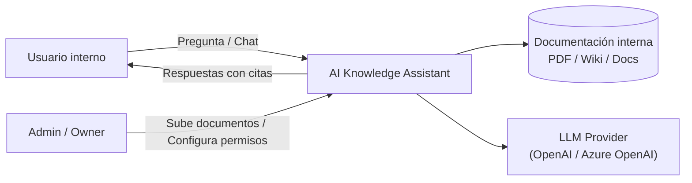
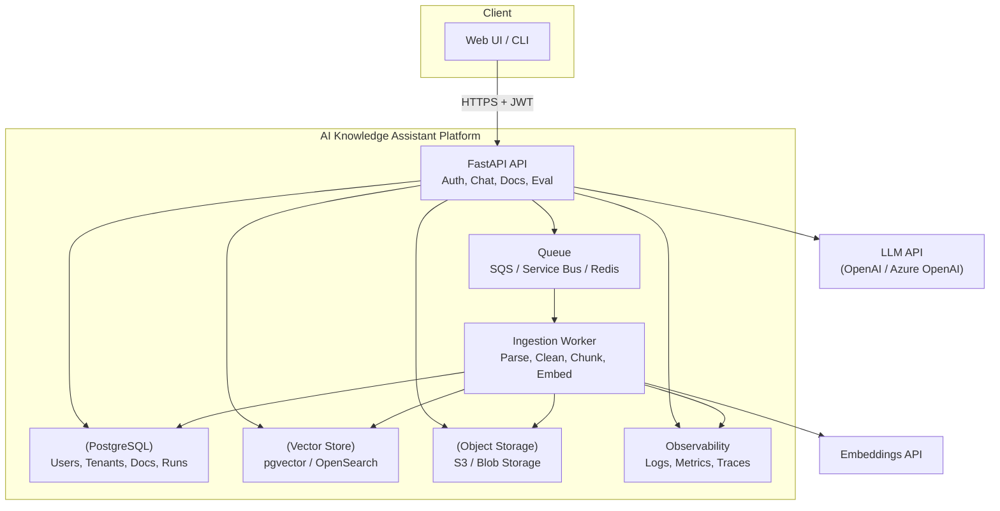
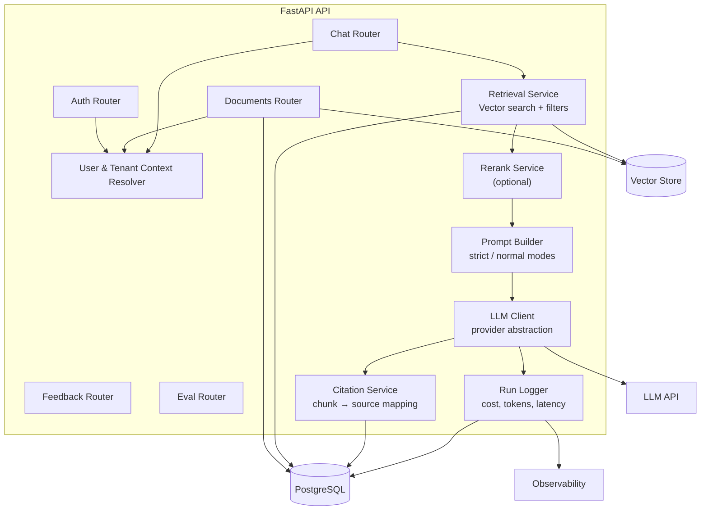

# Architecture

This document describes the architecture of the **AI Knowledge Assistant for Enterprises**.
The system is designed as a multi-tenant RAG platform with strict retrieval guarantees,
asynchronous ingestion, and full observability.

---

## Implementation status

The diagrams below describe the target architecture. Not all of it is built yet — stated
here explicitly instead of leaving the reader to assume the diagrams describe reality.

| Component (from the diagrams below) | Status |
|---|---|
| FastAPI API — Chat, Eval routers | **Real.** `apps/api/routers/{chat,eval,health}.py` |
| Auth Router / Documents Router / Feedback Router | **Not built.** Only `chat`, `eval`, `health` routers exist; no separate document-upload or feedback endpoints |
| Retrieval Service, Prompt Builder, Citation Service, Run Logger | **Real.** `apps/api/services/*` |
| Rerank Service | **Not built.** `use_rerank` exists as a request flag but there's no reranker implementation behind it |
| Vector Store (pgvector) | **Real.** `PgvectorVectorStore`, with RLS actually enforced (see README) |
| PostgreSQL (runs, conversations, eval, documents/chunks) | **Real** |
| Ingestion Worker + Queue (SQS/Service Bus/Redis) | **Not built.** `apps/api/services/ports.py` defines the Extractor/Loader/Normalizer/Chunker/DeadLetterQueue protocols and `IngestionService` has a real state machine, but nothing implements or wires them. The only working ingestion path today is the synchronous `scripts/ingest_documents.py` |
| Object Storage (S3/Blob) | **Not built.** Documents are ingested from local files, not uploaded/stored as blobs |
| Observability (OTel traces/metrics) | **Real.** `apps/api/services/observability.py`, OTLP export if configured |
| LLM / Embeddings API (OpenAI) | **Real.** `OpenAILLMClient`, `OpenAIEmbeddingService` |

---

## C4 – Level 1: System Context

```mermaid
flowchart LR
  U[Usuario interno] -->|Pregunta / Chat| S[AI Knowledge Assistant]
  A[Admin / Owner] -->|Sube documentos / Configura permisos| S
  S -->|Respuestas con citas| U

  S --> D[(Documentación interna<br/>PDF / Wiki / Docs)]
  S --> L["LLM Provider<br/>(OpenAI / Azure OpenAI)"]
```

**Explanation**

- Users interact with the system through natural language.
- Admins manage documents and access control.
- The system never answers without consulting internal documentation.
- LLMs are used only for reasoning and language generation.

---

## C4 – Level 2: Container Diagram

```mermaid
flowchart TB
  subgraph Client
    UI[Web UI / CLI]
  end

  subgraph Platform["AI Knowledge Assistant Platform"]
    API["FastAPI API<br/>Auth, Chat, Docs, Eval"]
    W["Ingestion Worker<br/>Parse, Clean, Chunk, Embed"]
    Q["Queue<br/>SQS / Service Bus / Redis"]
    DB["(PostgreSQL)<br/>Users, Tenants, Docs, Runs"]
    VS["(Vector Store)<br/>pgvector / OpenSearch"]
    OS["(Object Storage)<br/>S3 / Blob Storage"]
    OBS["Observability<br/>Logs, Metrics, Traces"]
  end

  LLM["LLM API<br/>(OpenAI / Azure OpenAI)"]
  EMB["Embeddings API"]

  UI -->|HTTPS + JWT| API
  API --> DB
  API --> OS
  API --> Q
  API --> VS
  API --> LLM
  API --> OBS

  Q --> W
  W --> OS
  W --> DB
  W --> VS
  W --> EMB
  W --> OBS
```

**Explanation**

- The API handles authentication, chat orchestration, and evaluation.
- Document ingestion is fully asynchronous via a worker and queue.
- Vector search and relational data are clearly separated.
- Observability is a first-class concern across API and workers.

---

## C4 – Level 3: Component Diagram (FastAPI API)

```mermaid
flowchart TB
  subgraph API["FastAPI API"]
    R1[Auth Router]
    R2[Documents Router]
    R3[Chat Router]
    R4[Feedback Router]
    R5[Eval Router]

    S1["User & Tenant Context Resolver"]
    S2["Retrieval Service<br/>Vector search + filters"]
    S3["Rerank Service<br/>(optional)"]
    S4["Prompt Builder<br/>strict / normal modes"]
    S5["LLM Client<br/>provider abstraction"]
    S6["Citation Service<br/>chunk → source mapping"]
    S7["Run Logger<br/>cost, tokens, latency"]
  end

  DB[(PostgreSQL)]
  VS[(Vector Store)]
  LLM[LLM API]
  OBS[Observability]

  R1 --> S1
  R2 --> S1
  R3 --> S1

  R2 --> DB
  R2 --> VS

  R3 --> S2 --> VS
  S2 --> DB
  S2 --> S3 --> S4 --> S5 --> LLM
  S5 --> S6 --> DB
  S5 --> S7 --> DB
  S7 --> OBS
```

**Explanation**

- Security context (tenant, role) is resolved before retrieval.
- Retrieval and reranking are isolated from prompt construction.
- Citation validation and run logging ensure traceability.
- LLM providers are abstracted to allow easy switching.

---

## Architectural Principles

- **LLM is not a source of truth**: documents are.
- **Retrieval before generation**: always.
- **Strict isolation between tenants**.
- **Asynchronous ingestion** for reliability and scalability.
- **Every answer is traceable** (documents, chunks, cost, latency).

---

## Non-Goals

- Not a general-purpose chatbot.
- Not a UI-focused product.
- Not a fine-tuned model showcase.

This project focuses on **engineering robustness**, **control**, and **production readiness**.
